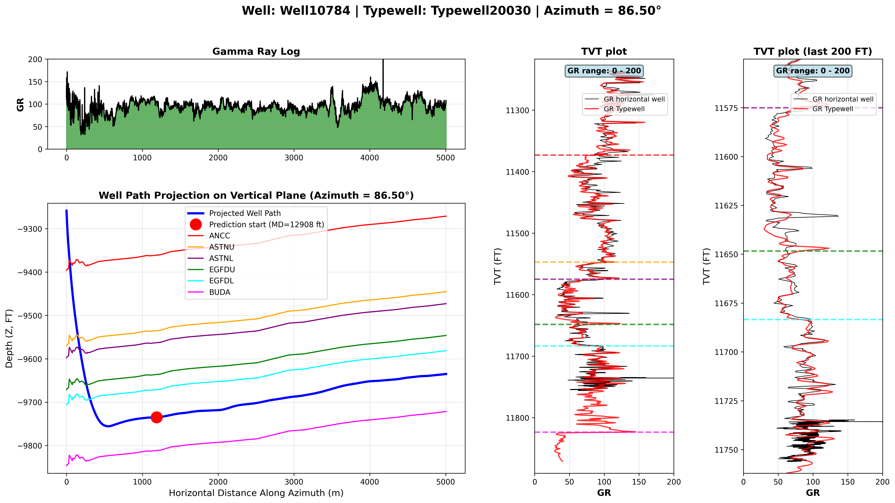
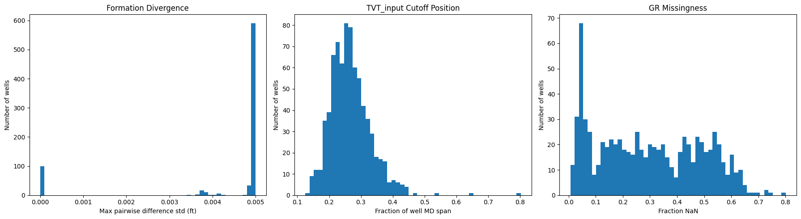
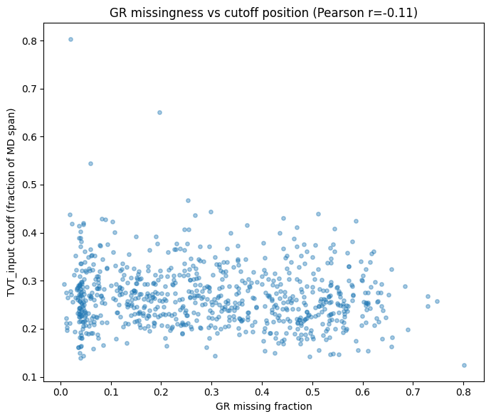
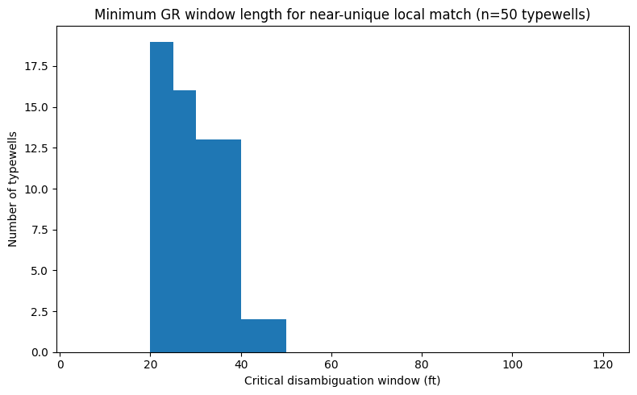
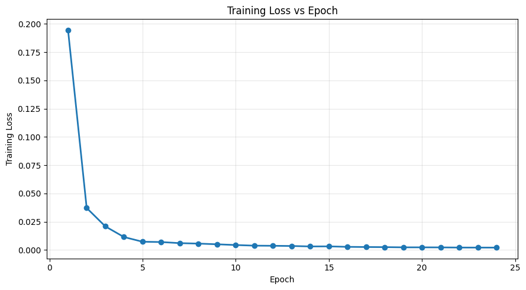
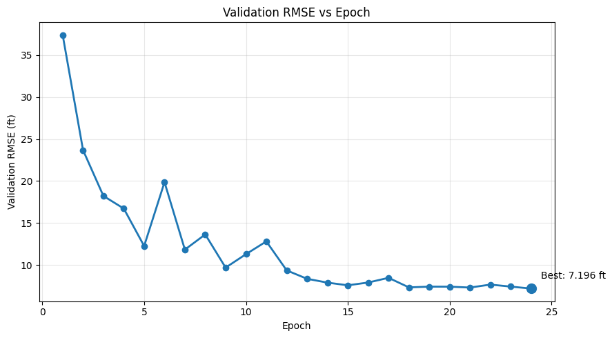
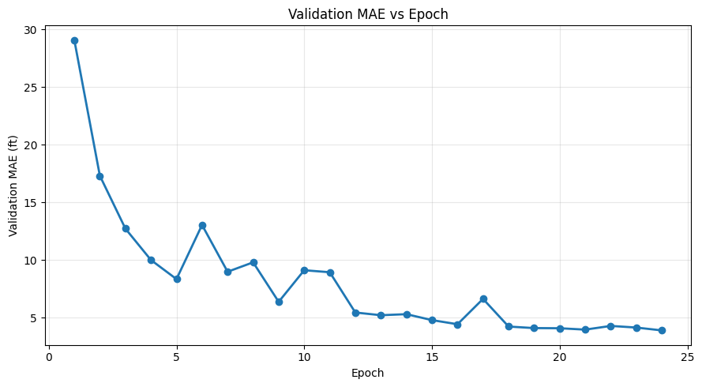
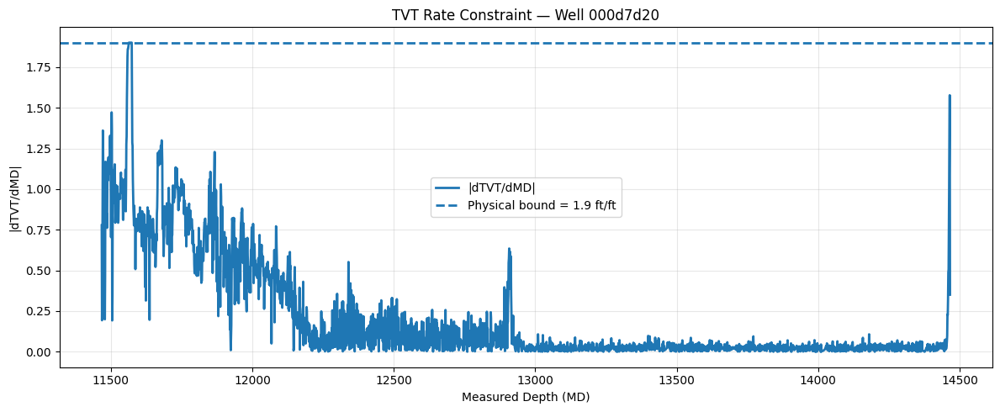

# ROGII Wellbore Geology Prediction

Predicting the geological position (`TVT` — True Vertical Thickness) of a horizontal
drill bit using its gamma-ray log and a nearby vertical reference well ("typewell"),
for the [Kaggle ROGII Wellbore Geology Prediction competition](https://www.kaggle.com/competitions/rogii-wellbore-geology-prediction).

Validation RMSE: **7.196 ft**

---

## 1. The physical problem

Drilling a horizontal well is navigation without a map. Rock is laid down in
roughly parallel strata; as the drill bit advances laterally it rises and falls
through that layer cake because the layers dip, and the driller needs to know
*which layer the bit is currently in* to stay inside the productive zone.

Two data sources are provided per well:

- **Horizontal well log** — gamma ray (`GR`) and 3D trajectory (`X`, `Y`, `Z`),
  recorded every 1 ft of measured depth (`MD`) along the drilled path.
- **Typewell** — a gamma-ray log from a nearby *vertical* well, recorded every
  0.5 ft of `TVT`. This is a known reference: "if you go straight down through
  this rock package, here's the GR signature you'd see at each stratigraphic
  depth."

`TVT` (the target) is not a raw depth — it is the horizontal well's position
*on the typewell's stratigraphic column*. Rock is radioactive in a way that
depends on lithology (shale content), so **GR is a physical proxy for rock
type**, and the core mechanism is:

> Match the *shape* of the horizontal well's GR curve against the *shape* of
> the typewell's GR-vs-TVT curve, and infer position from where they align.

Each well provides `TVT` labels up to some measured-depth cutoff (`TVT_input`),
after which the target is hidden — that's the actual prediction task: extend
the alignment forward into unlabeled territory.

<p align="center">
  <br>
  <sub>One example well: GR log (top-left), well trajectory with formation
  tops (bottom-left), and the GR-vs-TVT alignment between the horizontal well
  (black) and its typewell (red) that the model has to learn to reproduce.</sub>
</p>

---

## 2. Data understanding — physically grounded, not assumed

Before touching any model, we ran diagnostics across the *full* training set
(773 wells) to check three assumptions rather than guess at them.

### 2.1 Do rock layers move in lockstep, or is faulting common?

The six provided formation-top columns (`ANCC`, `ASTNU`, `ASTNL`, `EGFDU`,
`EGFDL`, `BUDA`) turn out to be **perfectly rigid parallel offsets of each
other in every single well** (max divergence < 0.005 ft, i.e. by
construction — these columns can't encode faulting even if it exists in
reality). Real faulting, if present, would instead show up as a
discontinuity in the GR-correlation signal itself — this remains an open
risk the model has no explicit mechanism to detect.

### 2.2 How much of each well is actually unlabeled?

Median cutoff point: **~26% of the way** into each well's measured-depth
span. That means on average **~74% of each lateral has no label** and must
be inferred — a much harder extrapolation task than a short "toe-end" tail.

### 2.3 Is GR-signal quality and label coverage correlated (do "hard" wells stack disadvantages)?

**No.** GR missingness (0–80% per well) and cutoff position are essentially
uncorrelated (Pearson r = -0.11). Difficulty is spread across two independent
axes, not concentrated in a subset of especially bad wells.

<p align="center">
  <br>
  <sub>Left: formation-column divergence across all 773 wells (all near the
  numerical floor — rigid by construction). Middle: TVT_input cutoff position
  as a fraction of well length (median ~27%). Right: GR missingness per well
  (highly variable, 0–80%).</sub>
</p>
<p align="center">
  <br>
  <sub>GR missingness vs. cutoff position — no meaningful correlation.</sub>
</p>

### 2.4 Locality: how much context does the model actually need?

This is the question that decides architecture. We measured, for a sample of
50 typewells, the smallest GR window length at which a local shape becomes
**unique** within that well (no near-duplicate pattern elsewhere that would
make position ambiguous):

- Below **~10 ft**, GR shape aliases heavily — 72% of short windows have a
  near-identical twin elsewhere in the same typewell.
- At **~20–40 ft** (mean 25 ft, std 5 ft, stable across all 50 sampled wells),
  ambiguity drops to ≈0%.

<p align="center">
  <br>
  <sub>Distribution of the minimum GR window length needed for near-unique
  local matching, across 50 sampled typewells.</sub>
</p>

**Conclusion:** the target is neither a pure pointwise function of the input
row, nor does the whole sequence matter equally everywhere. There is a
physically bounded local receptive field (tens of feet) that is necessary
and — in this idealized typewell-only test — close to sufficient to localize
position. TVT is also **rate-bounded**: it cannot jump between adjacent MD
samples (99th-percentile `|dTVT/dMD| ≈ 1.9 ft/ft`), which the model
explicitly enforces post-hoc (see §4).

---

## 3. Architecture

Given the above, the reflex "tabular GBM on engineered lag features" or a
single-sequence LSTM forecaster both miss something real: the task is
fundamentally a **two-sequence alignment problem** — matching the horizontal
well's GR sequence against a *separate* reference sequence (the typewell) —
not a single-sequence forecast, and not row-independent tabular regression.

The model implemented here (`CrossAttnTVTModel`) reflects that directly:

- **Two GRU encoders** — one over the horizontal well's feature sequence
  (GR, trajectory, engineered features), one over the typewell's GR-vs-TVT
  sequence — each producing a sequence of hidden states.
- **Cross-attention** (`nn.MultiheadAttention`) — the horizontal well's
  encoded states attend over the typewell's encoded states, letting the model
  learn *where in the typewell* each point of the horizontal well best
  aligns, rather than relying on hand-built correlation features.
- **A regression head** on top of the attended representation, producing a
  TVT prediction per horizontal-well row.

Post-processing enforces the physical rate bound found in §2.4: predicted
TVT is smoothed/clipped so that `|dTVT/dMD|` cannot exceed the empirically
measured physical limit.

---

## 4. Training & results

- **Loss**: regression loss on TVT (labeled region), computed in normalized/
  local coordinates.
- **Validation RMSE**: 7.196 ft (best epoch), down from 37.4 ft at epoch 1.
- **Validation MAE**: ~4 ft at convergence.

<p align="center">
  
  <br>
  
</p>

The learned rate-of-change of predicted TVT respects the physical bound
established in §2.4 almost everywhere, with the enforced clip visible as a
flat ceiling:

<p align="center">
  
</p>

---

## 5. Known limitations / open questions

- **Faulting is not directly detectable** with the current features — the
  provided formation-top columns cannot encode it (§2.1), and the model has
  no explicit discontinuity-detection mechanism. If faulted wells exist in
  the hidden test set, this is the most likely failure mode.
- The **20–40 ft disambiguation window** (§2.4) was measured on typewells in
  isolation — an idealized best case. Matching against the real, noisier,
  sometimes-80%-missing horizontal-well GR likely requires more context than
  this floor, not less.
- The submission-building step originally had two bugs (an `id`-parsing bug
  that mismatched every row's join key, and a training-only sequence-length
  cap that was silently also applied at test time, truncating predictions
  for longer wells). Both are fixed in the current notebook — see commit
  history / notebook comments for details.

---

## 6. Repo structure

```
.
├── README.md
├── notebooks/
│   └── rogii_tvt_prediction.ipynb   # full pipeline: data loading, EDA, model, training, inference, submission
└── images/                          # all figures referenced above
```
